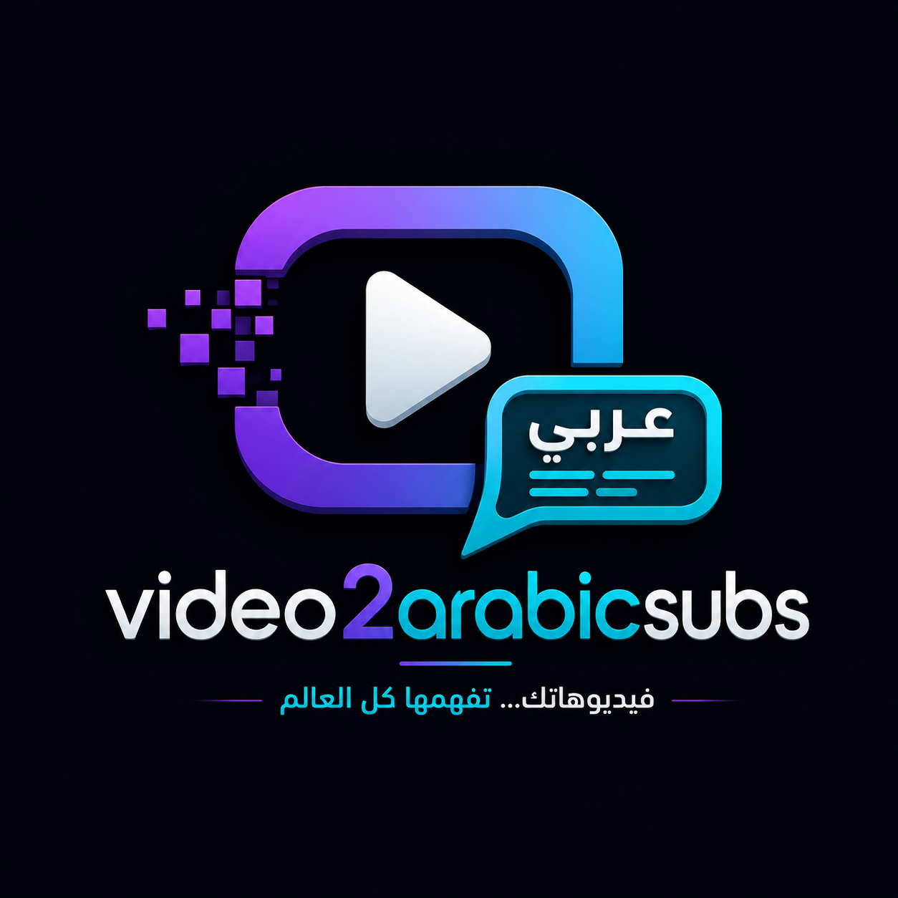
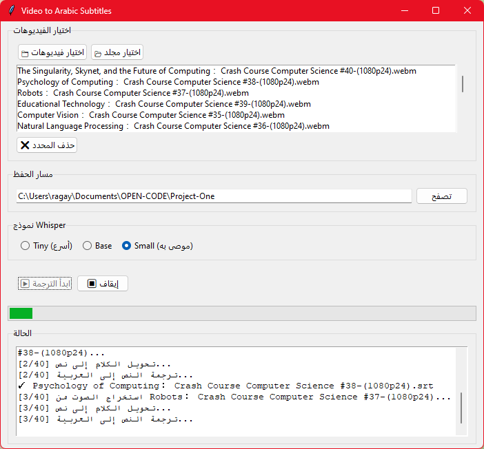

# 🎬 Video2ArabicSubs v0.1

<p align="center">
  
</p>

<p align="center">
  <strong>تحويل مقاطع الفيديو إلى ترجمة عربية (SRT) بسهولة</strong>
</p>

<p align="center">
  
  
  
  
  
</p>

---

## ✨ المميزات

- ✅ **واجهة رسومية** سهلة باللغة العربية
- ✅ **ترجمة دقيقة** باستخدام Whisper (OpenAI) + Google Translate
- ✅ **دعم جميع صيغ الفيديو** (MP4, AVI, MKV, MOV, WebM, FLV, MPG وغيرها)
- ✅ **اختيار نموذج Whisper** (Tiny سريع / Small دقيق)
- ✅ **معالجة متعددة** للفيديوهات دفعة واحدة
- ✅ **ترتيب الفيديوهات** ▲ ▼ حسب الرغبة
- ✅ **إشارة ✔ لكل فيديو** بعد إتمام ترجمته
- ✅ **إظهار في علبة النظام** System Tray
- ✅ **تثبيت تلقائي** للمكتبات المطلوبة
- ✅ **شريط تقدم + سجل تشغيل** بالتفصيل

---

## 📸 لقطة شاشة

<p align="center">
  
  
</p>

---

## 🚀 طريقة التشغيل

### المتطلبات الأساسية
- **Python 3.10+**
- **اتصال بالإنترنت** (لأول تشغيل لتحميل نموذج Whisper)

### 1. تحميل المشروع

```bash
git clone https://github.com/ragaei/Video2ArabicSubs.git
cd Video2ArabicSubs
```

### 2. تشغيل التطبيق

```bash
python main.py
```

> 🪄 عند أول تشغيل، سيقوم البرنامج **بتثبيت جميع المكتبات تلقائياً** ثم تحميل نموذج Whisper (~461 MB).

### 3. الاستخدام

1. **📁 اختيار فيديوهات** — اختر ملفات الفيديو
2. **📂 اختيار مجلد** — أو اختر مجلد كامل
3. **▲ ▼** — رتب الفيديوهات حسب الأفضلية
4. **📂 تصفح** — حدد مسار حفظ ملفات الترجمة
5. **اختيار النموذج** — Tiny (أسرع) أو Small (أدق)
6. **▶ ابدأ الترجمة** — وانطلق! 🎉

---

## ⚙️ التقنيات المستخدمة

| المكتبة | المهمة |
|---------|--------|
| [openai-whisper](https://github.com/openai/whisper) | تحويل الكلام إلى نص (Speech-to-Text) |
| [deep-translator](https://github.com/nidhaloff/deep-translator) | ترجمة إنجليزي → عربي |
| [moviepy](https://github.com/Zulko/moviepy) | استخراج الصوت من الفيديو |
| [imageio-ffmpeg](https://github.com/imageio/imageio-ffmpeg) | تضمين FFmpeg تلقائياً |
| [pysrt](https://github.com/byroot/pysrt) | كتابة ملفات SRT |
| [pystray](https://github.com/moses-palmer/pystray) | أيقونة علبة النظام |
| [Pillow](https://python-pillow.org/) | معالجة الصور والأيقونات |

---

## 🛠️ بناء نسخة محمولة (EXE)

```bash
pip install pyinstaller
pyinstaller video2arabicsubs.spec
```

سيتم إنشاء ملف التنفيذ في مجلد `dist/`.

---

## 📦 هيكل المشروع

```
Video2ArabicSubs/
├── main.py                         # نقطة الدخول
├── requirements.txt                # المكتبات المطلوبة
├── video2arabicsubs.spec           # إعدادات PyInstaller
├── img/
│   └── first-logo-design.png       # شعار التطبيق
├── screenshots/
│   ├── screenshots-1.png           # لقطة شاشة
│   └── ...
├── app/
│   ├── __init__.py                 # معلومات الإصدار
│   ├── gui.py                      # واجهة المستخدم
│   ├── processor.py                # منسق العمليات
│   ├── dependency_checker.py       # فحص وتثبيت المكتبات
│   ├── audio_extractor.py          # استخراج الصوت
│   ├── transcriber.py              # تحويل الكلام → نص
│   ├── translator.py               # ترجمة
│   └── subtitle_writer.py          # كتابة SRT
└── README.md
```

---

## 👨‍💻 المطور

- **Ragaei Muhammed**
- 🚀 Powered by [OpenCode](https://opencode.ai)

---

## 📄 الترخيص

هذا المشروع مرخص تحت **MIT License** — انظر ملف [LICENSE](LICENSE) للتفاصيل.

---

<p align="center">
  <b>Made with ❤️</b>
</p>
